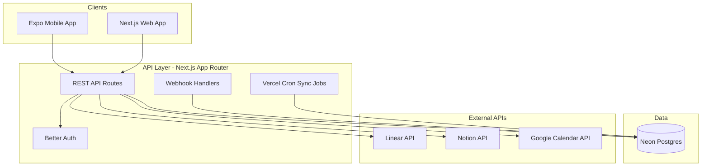
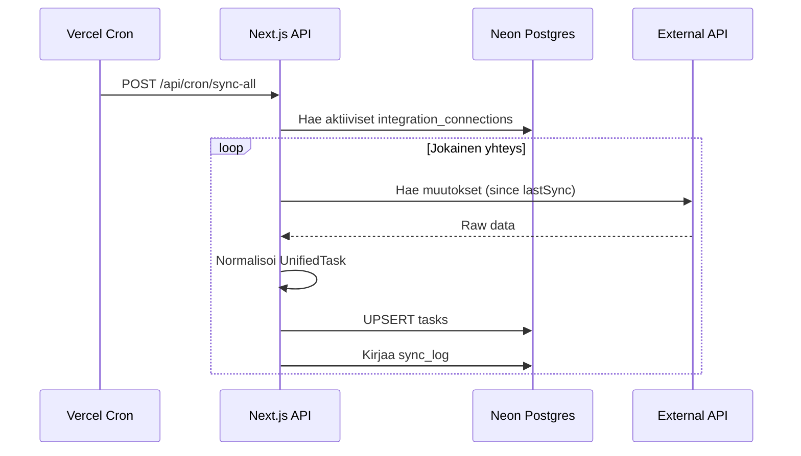
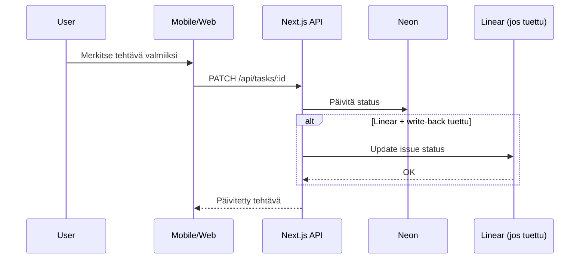

# Arkkitehtuuri

## Yleiskuva



## Monorepo (Turborepo + pnpm)

```
yksi/
├── apps/
│   ├── mobile/          # Expo SDK 52+ / Expo Router
│   └── web/             # Next.js 15 App Router
├── packages/
│   ├── ui/              # shadcn/Radix + design tokenit
│   ├── db/              # Drizzle ORM + skeema
│   ├── core/            # Domain-mallit, normalisointi
│   ├── integrations/    # Provider-adapterit
│   └── config/          # Jaettu ESLint, TS, Tailwind
├── ui/                  # HTML-mockupit (referenssi)
└── docs/
```

## Pakettiriippuvuudet

```
apps/mobile  → @yksi/ui, @yksi/core
apps/web     → @yksi/ui, @yksi/db, @yksi/core, @yksi/integrations
packages/integrations → @yksi/core, @yksi/db
packages/db  → (standalone, Drizzle + Neon)
packages/core → (standalone, puhtaat tyypit ja funktiot)
packages/ui  → (standalone, React-komponentit)
```

## Datavirta: synkronointi



## Datavirta: käyttäjän toiminto



## Autentikointi

- **Better Auth** hallinnoi käyttäjäsessioita
- Web: cookie-pohjainen sessio
- Mobile: Bearer token (Expo SecureStore)
- Integraatio-OAuth: erillinen flow `/api/integrations/:provider/connect`

## Token-salaus

Integraatioiden OAuth-tokenit tallennetaan `integration_connections`-tauluun AES-256-salattuna.

```
plaintext token → encrypt(INTEGRATION_TOKEN_ENCRYPTION_KEY) → DB
DB → decrypt(key) → plaintext token → API call
```

## Deploy

| Komponentti | Palvelu | URL |
|-------------|---------|-----|
| Web + API | Vercel | `yksi.app` (tuotanto) |
| Tietokanta | Neon | Serverless Postgres |
| Mobiili | EAS Build | TestFlight / Play Store |
| Cron | Vercel Cron | `/api/cron/sync-all` (5 min) |

## Ympäristöt

| Ympäristö | Web URL | DB |
|-----------|---------|-----|
| local | localhost:3000 | Neon dev branch tai local Postgres |
| preview | `*.vercel.app` | Neon preview branch |
| production | yksi.app | Neon main branch |

## Virheenkäsittely

- Sync-virheet kirjataan `sync_logs`-tauluun (`status: error`, `error_message`)
- API palauttaa RFC 7807 -tyyliset virheet: `{ error: string, code: string }`
- Integraatio-tokenin vanheneminen: automaattinen refresh, jos epäonnistuu → merkitse yhteys `disconnected`
