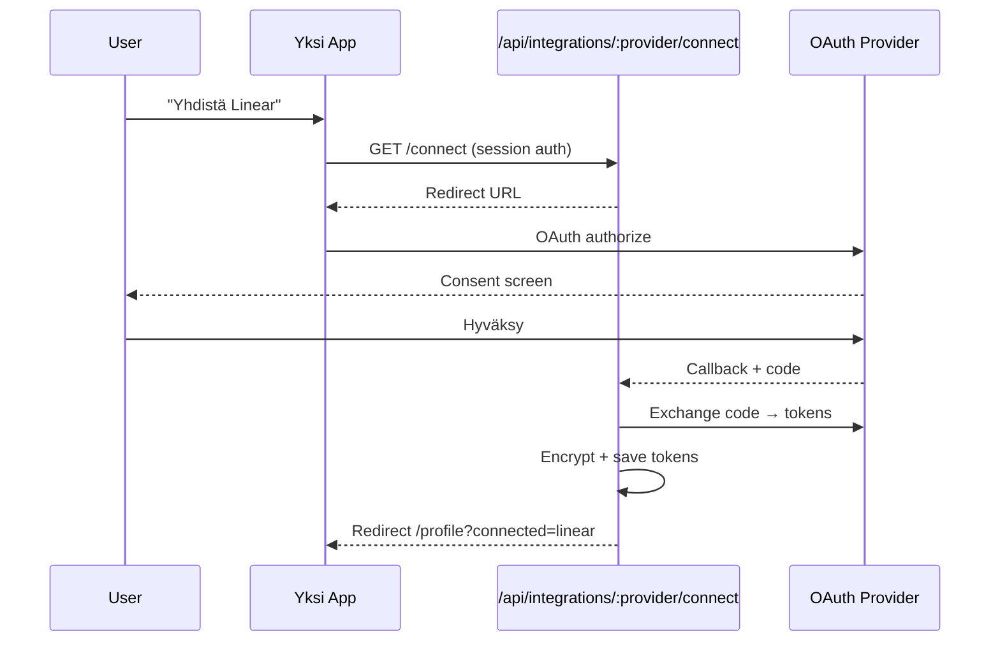

# Integraatiot

MVP tukee kolmea integraatiota: Linear, Notion ja Google Calendar.

## Yleinen OAuth-flow



## Linear

### OAuth

- **Authorize URL:** `https://linear.app/oauth/authorize`
- **Token URL:** `https://api.linear.app/oauth/token`
- **Scopes:** `read`, `write`, `issues:create`
- **Env:** `LINEAR_CLIENT_ID`, `LINEAR_CLIENT_SECRET`

### Synkronointi

1. **Webhook (ensisijainen):** `POST /api/webhooks/linear`
   - Rekisteröi webhook Linearissa yhteyden luonnin yhteydessä
   - Käsittele: `Issue`, `IssueUpdate`
2. **Polling (fallback):** Cron hakee `issues(updatedAt > lastSyncedAt)`

### API-kutsut

```graphql
# Hae kaikki avoimet issuet
query {
  issues(filter: { updatedAt: { gte: $since } }) {
    nodes {
      id title description url dueDate priority
      state { type name }
      labels { nodes { name } }
      project { id name }
      team { id name }
    }
  }
}
```

### Kaksisuuntainen synkka (MVP)

| Toiminto | Tuettu |
|----------|--------|
| Merkitse valmiiksi | Kyllä → `issueUpdate(stateId: completedStateId)` |
| Muuta prioriteetti | Kyllä → `issueUpdate(priority: N)` |
| Luo uusi issue | Ei MVP:ssä |
| Muuta otsikkoa | Ei MVP:ssä |

### Normalisointi

Katso [DATA-MODEL.md](DATA-MODEL.md#linear-issue--unifiedtask).

---

## Notion

### OAuth

- **Authorize URL:** `https://api.notion.com/v1/oauth/authorize`
- **Token URL:** `https://api.notion.com/v1/oauth/token`
- **Env:** `NOTION_CLIENT_ID`, `NOTION_CLIENT_SECRET`

### Synkronointi

- **Vain polling** (5 min cron) — Notion ei tue webhookeja samalla tavalla
- Käyttäjä valitsee synkattavat tietokannat profiilissa (`metadata.databaseIds`)

### API-kutsut

```
GET /v1/search?filter[object]=database
GET /v1/databases/{id}/query
GET /v1/pages/{id}
```

### Kenttämapping

Notion-tietokantojen property-tyypit mapataan dynaamisesti:

| Notion property type | UnifiedTask field |
|---------------------|-------------------|
| `title` | `title` |
| `rich_text` | `description` |
| `status` / `select` | `status` (mapping config) |
| `date` (end) | `dueAt` |
| `date` (start) | `startAt` |
| `multi_select` | `labels` |

Käyttäjä konfiguroi mappingin ensimmäisellä yhdistämisellä tai käytetään oletuksia (ensimmäinen status/date/select-kenttä).

### Kaksisuuntainen synkka

**Ei MVP:ssä** — vain luku. Kirjoitus lisätään premium-versiossa.

### Rate limits

- 3 requests/second per integration
- Toteutus: debounce, synkkaa vain valitut tietokannat, käytä `last_edited_time` filteriä

---

## Google Calendar

### OAuth

- **Scopes:** `https://www.googleapis.com/auth/calendar.readonly`
- **Env:** `GOOGLE_CLIENT_ID`, `GOOGLE_CLIENT_SECRET`
- Huom: käytä samaa Google OAuth -clientia kuin Better Auth loginissa, eri scope

### Synkronointi

- **Polling:** Cron hakee tapahtumat `timeMin=lastSyncedAt`, `timeMax=+30 days`
- Käyttäjä valitsee kalenterit profiilissa (`metadata.calendarIds`)

### API-kutsut

```
GET /calendar/v3/users/me/calendarList
GET /calendar/v3/calendars/{id}/events?timeMin=...&timeMax=...&singleEvents=true
```

### Normalisointi

Katso [DATA-MODEL.md](DATA-MODEL.md#google-calendar-event--unifiedtask).

### Kaksisuuntainen synkka

**Ei MVP:ssä** — vain luku. Premium: luo/muokkaa tapahtumia.

---

## Token-hallinta

```typescript
// packages/integrations/src/crypto.ts
encryptToken(plaintext: string): string  // AES-256-GCM
decryptToken(ciphertext: string): string

// Automaattinen refresh
async function getValidToken(connection: IntegrationConnection): Promise<string> {
  if (connection.tokenExpiresAt > now + 5min) return decrypt(connection.accessToken)
  const refreshed = await refreshToken(connection)
  await saveTokens(connection.id, refreshed)
  return refreshed.accessToken
}
```

## Virheenkäsittely

| Virhe | Toiminto |
|-------|----------|
| 401 Unauthorized | Yritä token refresh |
| 403 Forbidden | Merkitse `status: error`, ilmoita käyttäjälle |
| 429 Rate limited | Odota + retry exponential backoff |
| 5xx Server error | Kirjaa sync_log, yritä seuraavalla cronilla |

## Freemium-rajat

Ilmainen tili: max 3 integraatiota (Linear + Notion + GCal = täynnä).
Premium: rajaton määrä (tulevaisuudessa lisäprovidereita).

Tarkistus: `POST /api/integrations/:provider/connect` → jos `free` ja `connections.length >= 3` → 403.
